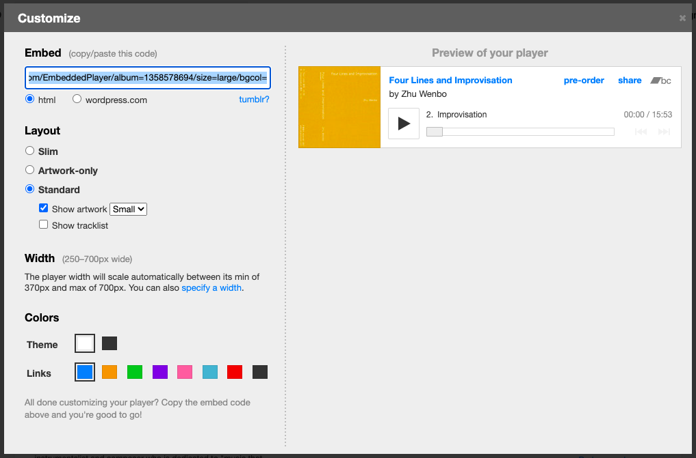

# 使用手册

## 登录后台

打开网址 https://aloerecords.com/admin/ 后输入邮箱密码即可编辑。如果忘了邮箱密码或者创建新的用户，可以联系星驰。

## 新建文章

首次创建文章时的 `title` 需要是英文的，因为第一次创建文章时同时会生成文章的 URL，比如 https://aloerecords.com/blog/a-small-matter-to-tell/ 这篇，其中的 `a-small-matter-to-tell` 就是通过首次提交的 `title` —— **A small matter to tell you about** 生成的。

生成之后，就可以自由修改 `title` 了，比如改成中文的。这个有点反直觉，但囿于编辑后台的代码逻辑，目前只能这样。

另外，文章的 `description` 在网站页面中是看不到的，这个是配合 SEO（搜索引擎优化）的。还有就是在分享文章到 Facebook 之类的平台时，会提取文章摘要，就可以看到。

再注：插入图片之后的 `alt` 标签里不要有 `#` 之类的特殊字符，这个 `alt` 标签是在图片加载不出来或者盲人的设备上使用的（会读出），图片正常加载的话，也看不到这段描述。

## 插入 Bandcamp

在文章内容中插入下面的代码片段：

```

```

其中，`id` 对应要分享的专辑的 album id，在 Bandcamp 中看到的步骤为：点击专辑图下方的 Share/Embed -> Embed this album -> Select a style，然后就可以看到类似下图的：



其中代码片段的 `album=1358578694` 的 `1358578694` 就是我们要分享的专辑的 `id`。然后把上面的代码片段改为下面的就行了。

```

```

另外，`layout` 还支持 `large`；以及单曲（track）的分享，分享单曲的代码片段如下：

```

```

其中的 `id` 是要分享的 track 的 `id`。

## 插入 Vimeo

在文章中插入下面的代码片段：

```

```

其中的数字是在 Vimeo 播放视频时，浏览器地址栏中的视频编号，比如这个视频 [happy music trio - living room tour beijing 20220901](https://vimeo.com/746488176)。

## 插入 YouTube

在文章中插入下面的代码片段：

```

```

其中的字符串是播放视频时，浏览器地址栏中的视频编号，比如这段视频 ["This is Diego Chamy (Speak Aloud 2)", Diego Chamy solo performance](https://www.youtube.com/watch?v=1mY7RbtYsp0) 的实际地址是 `https://www.youtube.com/watch?v=1mY7RbtYsp0`，那么，取 `v=1mY7RbtYsp0` 中 `v=` 右边的字符串就行。

## 插入 Bilibili

在文章中插入下面的代码片段：

```

```

其中的数字，是要分享的视频的 `aid` 的值，这个数字不是地址栏中的编号，而是需要点击分享 -> 嵌入代码，然后得到类似下面的代码片段：

```html
<iframe src="//player.bilibili.com/player.html?aid=986912796&bvid=BV1mt4y1u76c&cid=875350448&page=1" scrolling="no" border="0" frameborder="no" framespacing="0" allowfullscreen="true"> </iframe>
```

其中的 `aid=` 之后，`&bvid=` 之前的数字 `986912796` 就是我们需要的。